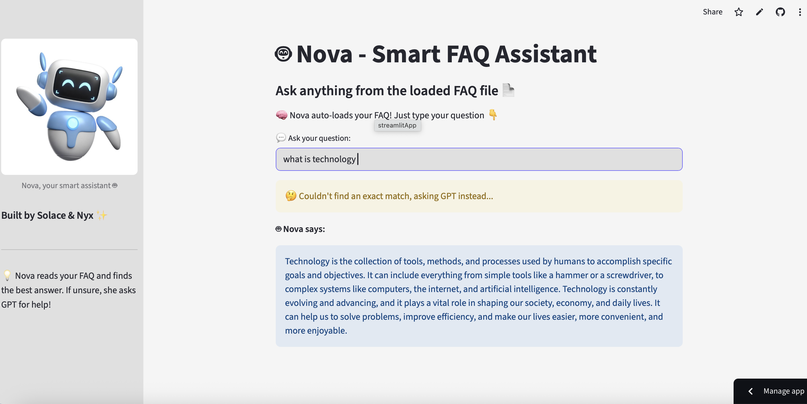

# 🤖 Nova - Smart FAQ Assistant

Nova is your intelligent, friendly FAQ assistant that automatically loads your FAQ CSV file and answers questions instantly. If she can't find a good answer, she asks a powerful LLM like GPT for help — no manual uploads, no fuss.

> 📁 Auto-loads `faqs.csv` from your project folder  
> ⚙️ Uses TogetherAI's Mixtral-8x7B or OpenRouter models  
> 🎨 Built with Streamlit — deploy and go!

---

## ✨ Features

- 🔎 Smart FAQ Matching using fuzzy similarity
- 💬 GPT-backed fallback when FAQ doesn’t help
- 🧠 Powered by Together AI or OpenRouter
- 📸 Sidebar image of Nova (customizable)
- 💡 No manual upload needed — auto-loads `faqs.csv`
- ⚡️ Easily deployable on [Streamlit Cloud](https://streamlit.io/cloud)

---

## 🛠️ Setup Instructions

### 1. Clone this repository

```bash
git clone https://github.com/your-username/nova-faq-assistant.git
cd nova-faq-assistant
```

### 2. Add your `faqs.csv` file

Make sure it's formatted like this:

```
Question,Answer
What is AI?,Artificial Intelligence is...
What is ML?,Machine Learning is...
```

### 3. Add your secrets

Create a file named `.streamlit/secrets.toml` and paste:

```toml
[together]
api_key = "your_together_api_key_here"
```

(Or use `[openrouter]` instead with the correct key.)

### 4. Install requirements

```bash
pip install -r requirements.txt
```

### 5. Run locally

```bash
streamlit run nova_app.py
```

---

## 🚀 Deploy on Streamlit Cloud

1. Push your project to GitHub  
2. Go to [Streamlit Cloud](https://streamlit.io/cloud)  
3. Connect your repo and set `nova_app.py` as the main file  
4. Add your API key in **Secrets**  
5. Deploy and share your app! ✨

---

## 📷 Screenshot



---

## 💖 Credits

Built with 💙 by **Solace & Nyx**  
Powered by **Together AI** and **Streamlit**
